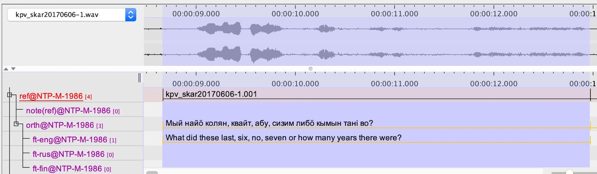

DeepSpeech-ELAN v0.1.0
======================

This project is very experimental and entirely based to Christopher Cox's
`Persephone-ELAN <https://github.com/coxchristopher/persephone-elan/>`_ .
Project layout and design follows entirely Cox's implementation, besides 
the part where a different ASR tool is used. That project is used as a template also
in the current version of README file.

This work connects to DeepSpeech experiments done and published in 2020 by 
Nils Hjortnaes, Timofey Arkhangelskiy, Niko Partanen, Michael Rießler and Francis Tyers.

Code related to DeepSpeech in this project has been written by Niko Partanen within 
Kone Foundation funded research project `Language Documentation meets Language Technology: The Next Step in the Description of Komi <https://langdoc.github.io/IKDP-2/>`_.

Concept
-------

The idea is that it is possible to call DeepSpeech model directly from ELAN
using custom recognizer. If we have a starting point like this:

Then we can select DeepSpeech-ELAN from the Recognizers-panel:

.. image:: screenshots/layout.png

We need to point into correct DeepSpeech model (.pb or .pbmm formats), 
optionally to a language model file that tries to fix the output, and
to a temporary location where an intermediate XML file is saved. Exact 
instructions are below.

When we run the DeepSpeech, new tier will be generated with the predicted
content. If we run the model again (i.e. without the language model), a 
number will be appended to the name.

.. image:: screenshots/layout.png

English DeepSpeech models can be downloaded from `DeepSpeech website <https://github.com/mozilla/DeepSpeech/releases/tag/v0.7.4>`_ . This would be one easy way to test our extension.

Requirements and installation
-----------------------------

DeepSpeech-ELAN makes use of several of other open-source applications and
utilities:

* `ELAN <https://tla.mpi.nl/tools/tla-tools/elan/>`_ 
* `Python 3 <https://www.python.org/>`_ 
* `ffmpeg <https://ffmpeg.org>`_

DeepSpeech-ELAN is written in Python 3, and also depends on the following
Python packages:

* `DeepSpeech <https://github.com/mozilla/DeepSpeech/>`_, installed
  system-wide (currently tested with DeepSpeech 0.7.1 under Python
  3.6) and all of its dependencies
* `pydub <https://github.com/jiaaro/pydub>`_, installed system-wide
  
Once all of these tools and packages have been installed, DeepSpeech-ELAN can
be made available to ELAN as follows:

#. Clone `this repository <https://github.com/langdoc/deepspeech-elan>`_
   and copy the files into a single directory (e.g., ``DeepSpeech-ELAN``).
#. Edit the file ``deepspeech-elan.sh`` to specify (a) the absolute path of
   the Python 3 binary that DeepSpeech-ELAN should use, (b) the directory
   in which ffmpeg is located, and (c) a Unicode-friendly language and
   locale (if ``en_US.UTF-8`` isn't available on your computer).
#. To make DeepSpeech-ELAN available to ELAN, move your DeepSpeech-ELAN directory
   into ELAN's ``extensions`` directory.  This directory is found in different
   places under different operating systems:
   
   * Under macOS, right-click on ``ELAN_5.8`` in your ``/Applications``
     folder and select "Show Package Contents", then copy your ``DeepSpeech-ELAN``
     folder into ``ELAN_5-8.app/Contents/Java/extensions``.
   * Under Linux, copy your ``DeepSpeech-ELAN`` folder into ``ELAN_5-8/app/extensions``.
   * Under Windows, copy your ``DeepSpeech-ELAN`` folder into ``C:\Users\AppData\Local\ELAN_5-8\app\extensions``.

Once ELAN is restarted, it will now include 'DeepSpeech-ELAN' in
the list of Recognizers found under the 'Recognizer' tab in Annotation Mode.
The user interface for this recognizer allows users to enter the settings needed
to apply an existing, pre-trained DeepSpeech ASR model to all of
the annotations found on a specified tier. Also the language model has to be specified.

Once these settings have been entered in DeepSpeech-ELAN, pressing the ``Start``
button will begin applying the specified DeepSpeech ASR model to
all of the time-aligned annotations on the selected tier.  Once that process is
complete, if no errors occurred, ELAN will allow the user to load the resulting
tier with the automatically recognized text strings into the current
transcript.

Acknowledgements
----------------

Thanks to `Christopher Cox <https://github.com/coxchristopher>`_ for his work with Persephone-ELAN. Acknowledgements of that project are included here as well.

Thanks are due to all of the contributors to Persephone, including `Oliver Adams
<https://oadams.github.io/>`_ and `Alexis Michaud <https://lacito.vjf.cnrs.fr/membres/michaud.htm>`_,
whose support and feedback contributed directly to the development of
Persephone-ELAN.  Thanks, as well, to `Han Sloetjes <https://www.mpi.nl/people/sloetjes-han>`_
for his help with issues related to ELAN's local recognizer specifications.

Citing DeepSpeech-ELAN
----------------------

If referring to this code in a publication, please consider refering to the following works in a manner that is most reasonable:

::

  @manual{cox19persephoneelan,
    title = {Persephone-ELAN: Automatic phoneme recognition for ELAN users},
    author = {Christopher Cox},
    year = {2019}
    note = {Version 0.1.2},
    }

  @manual{partanen2020deepspeechelan,
    title = {DeepSpeech-ELAN},
    author = {Niko Partanen},
    year = {2020}
    note = {Version 0.1.0},
    }

  @inproceedings{hjortnaesEtAl2020a,
    author = {Hjortnaes, Nils and Partanen, Niko and Rie{\ss}ler, Michael and Tyers, Francis M.},
    title = {Towards a speech recognizer for {K}omi, an endangered and low-resource {U}ralic language},
    booktitle = {Proceedings of the {S}ixth {I}nternational {W}orkshop on {C}omputational {L}inguistics of {U}ralic {L}anguages},
    editor = {Pirinen, Tommi A. and Tyers, Francis M. and Rießler, Michael},
    year = {2020},
    pages = {31-37},
    url = {https://www.aclweb.org/anthology/2020.iwclul-1.5/}
    }

  @inproceedings{hjortnaesEtAl2020b,
    author = {Hjortnaes, Nils and Arkhangelskiy, Timofey and Partanen, Niko and Rie{\ss}ler, Michael and Tyers, Francis M.},
    title = {Improving the language model for low-resource {ASR} with online text corpora},
    booktitle = {Proceedings of the 1st joint {SLTU} and {CCURL} workshop (SLTU-CCURL 2020)},
    editor = {Dorothee Beermann and Laurent Besacier and Sakriani Sakti and Claudia Soria},
    publisher = {European Language Resources Association (ELRA)},
    year = {2020},
    pages = {336-341},
    url = {http://www.lrec-conf.org/proceedings/lrec2020/workshops/SLTUCCURL/pdf/2020.sltuccurl-1.47.pdf}
    }

