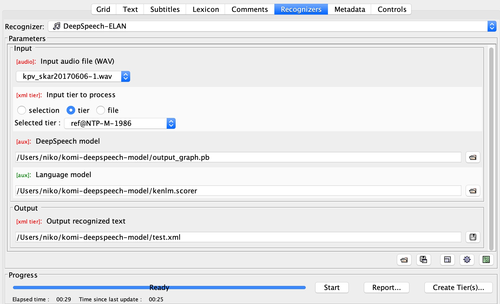

DeepSpeech-ELAN v0.0.1
======================

This project is very experimental and entirely based to Christopher Cox's
`Persephone-ELAN <https://github.com/coxchristopher/persephone-elan/>`_ , 
even to the degree that in this early version the Persephone specific scripts 
have not been adapted to DeepSpeech. That project is used as a template also
in the current version of README file.

The project connects to DeepSpeech experiments done and published in 2020 by Nils Hjortnaes, Timofey Arkhangelskiy, Niko Partanen, Michael Rießler and Francis Tyers.

Concept
-------

The idea is that it is possible to call DeepSpeech model directly from ELAN
using custom recognizer. This is one example of how it could look like:

Requirements and installation
-----------------------------

DeepSpeech-ELAN makes use of several of other open-source applications and
utilities:

* `ELAN <https://tla.mpi.nl/tools/tla-tools/elan/>`_ (tested with v5.6-AVFX,
  v5.7-AVFX, and v5.8 under macOS 10.13 and 10.14)
* `Python 3 <https://www.python.org/>`_ (tested with Python 3.6 and 3.7)
* `ffmpeg <https://ffmpeg.org>`_

DeepSpeech-ELAN is written in Python 3, and also depends on the following
Python packages:

* `DeepSpeech <https://github.com/mozilla/DeepSpeech/>`_, installed
  system-wide (currently tested with Persephone 0.3.2 and 0.4.0 under Python
  3.6 and 3.7) and all of its dependencies
* `pydub <https://github.com/jiaaro/pydub>`_, installed system-wide (tested
  with v0.20.0)
  
Once all of these tools and packages have been installed, DeepSpeech-ELAN can
be made available to ELAN as follows:

#. Clone `this repository <https://github.com/langdoc/deepspeech-elan>`_
   and copy the files into a single directory (e.g., ``DeepSpeech-ELAN``).
#. Edit the file ``deepspeech-elan.sh`` to specify (a) the absolute path of
   the Python 3 binary that DeepSpeech-ELAN should use, (b) the directory
   in which ffmpeg is located, and (c) a Unicode-friendly language and
   locale (if ``en_US.UTF-8`` isn't available on your computer).
#. To make DeepSpeech-ELAN available to ELAN, move your DeepSpeech-ELAN directory
   into ELAN's ``extensions`` directory.  This directory is found in different
   places under different operating systems:
   
   * Under macOS, right-click on ``ELAN_5.8`` in your ``/Applications``
     folder and select "Show Package Contents", then copy your ``DeepSpeech-ELAN``
     folder into ``ELAN_5-8.app/Contents/Java/extensions``.
   * Under Linux, copy your ``DeepSpeech-ELAN`` folder into ``ELAN_5-8/app/extensions``.
   * Under Windows, copy your ``DeepSpeech-ELAN`` folder into ``C:\Users\AppData\Local\ELAN_5-8\app\extensions``.

Once ELAN is restarted, it will now include 'DeepSpeech' in
the list of Recognizers found under the 'Recognizer' tab in Annotation Mode.
The user interface for this recognizer allows users to enter the settings needed
to apply an existing, pre-trained DeepSpeech ASR model to all of
the annotations found on a specified tier. Also the language model has to be specified.

Once these settings have been entered in DeepSpeech-ELAN, pressing the ``Start``
button will begin applying the specified DeepSpeech ASR model to
all of the time-aligned annotations on the selected tier.  Once that process is
complete, if no errors occurred, ELAN will allow the user to load the resulting
tier with the automatically recognized text strings into the current
transcript.

Limitations
-----------

At the moment (0.0.1) this doesn't work.

Acknowledgements
----------------

Thanks to `Christopher Cox <https://github.com/coxchristopher>`_ for his work with Persephone-ELAN. Acknowledgements of that project are included here as well.

Thanks are due to all of the contributors to Persephone, including `Oliver Adams
<https://oadams.github.io/>`_ and `Alexis Michaud <https://lacito.vjf.cnrs.fr/membres/michaud.htm>`_,
whose support and feedback contributed directly to the development of
Persephone-ELAN.  Thanks, as well, to `Han Sloetjes <https://www.mpi.nl/people/sloetjes-han>`_
for his help with issues related to ELAN's local recognizer specifications.

Citing DeepSpeech-ELAN
----------------------

More exact citation information will follow. However, at the moment it is most adviced to refer directly to Christopher Cox's original work.

If referring to this code in a publication, please consider using the following
citation:

    Cox, Christopher. 2019. Persephone-ELAN: Automatic phoneme recognition for
    ELAN users. Version 0.1.2.

::

    @manual{cox19persephoneelan,
    title = {Persephone-ELAN: Automatic phoneme recognition for ELAN users},
    author = {Christopher Cox},
    year = {2019}
    note = {Version 0.1.2},
    }
